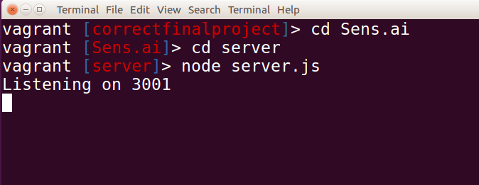
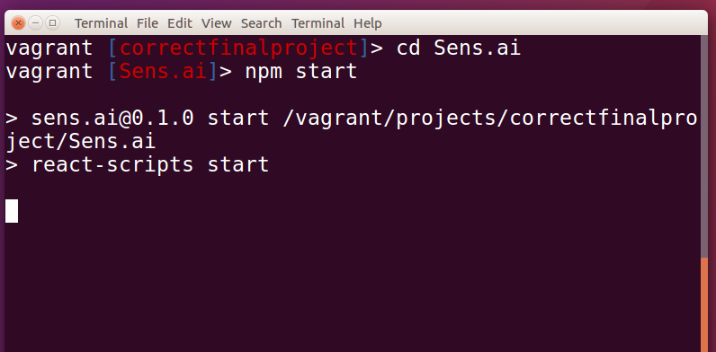
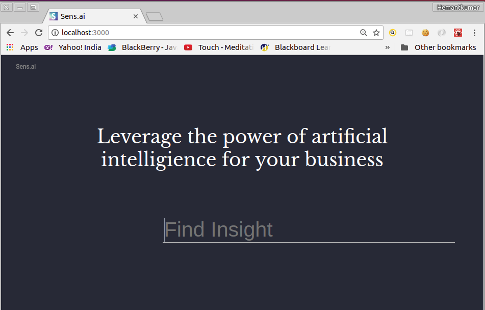

# Sens.ai - Brand Analysis Platform

### Project Description

Sens.ai is a powerful marketing research tool that leverages artificial intelligence to uncover valuable data for marketing/advertisement purposes. The app fetches content (posts, tweets etc.) from a couple different social media sites, and runs it through two different AI API's. The first is an Intent Analyzer by Parallel Dots. Simply put, this analyzer acts as a filter. Only the posts that showcase an opinion or some kind of feedback gets passed through the filter. The AI can actually detect the intention behind the text. The next stage is a Sentiment Analyzer that will return to us the sentiment expressed behind a text (in this case only opinionated posts are analyzed). We then take all the analytics and create compute statistics which is finally rendered for inspection. 

### Target auidence

  - Marketing Teams
  - Advertising Campaigns
  - Political Campaigns

### Team Members

- Sebastian Valiente (https://github.com/sebastianvaliente)
- Mikaal Naik (https://github.com/mikaalnaik)
- Cem Hekimoglu (https://github.com/cemhekimoglu)
- Hemantkumar Panchal (https://github.com/panchalhemant2001)

## Stack Choices
  
  - React
  - Node.js / Express
  - PostgreSQL
  
## Project Setup

- Clone this project from git Repo (Write following commands on vagrant)

```
git clone <git repo uri for this project> Sens.ai
```

### dependencies

- "bluebird": "^3.5.1",
- "body-parser": "^1.18.3",
- "change-case": "^3.0.2",
- "chart.js": "^2.7.2",
- "dom-scroll-into-view": "^1.2.1",
- "dotenv": "^6.0.0",
- "express": "^4.16.3",
- "knex": "^0.14.6",
- "moment": "^2.22.2",
- "node-fetch": "^2.1.2",
- "paralleldots": "^3.1.1",
- "pg": "^7.4.3",
- "react": "^16.4.0",
- "react-addons-transition-group": "^15.6.2",
- "react-anchor-link-smooth-scroll": "^1.0.10",
- "react-burger-menu": "^2.5.0",
- "react-chartjs-2": "^2.7.2",
- "react-dom": "^16.4.0",
- "react-fade": "^1.1.1",
- "react-fade-in": "^0.1.6",
- "react-flexbox-grid": "^2.1.2",
- "react-scripts": "1.1.4",
- "react-scroll-into-view": "^1.2.0",
- "react-scroll-to-component": "^1.0.2",
- "react-scrollable-anchor": "^0.6.1",
- "react-spinners": "^0.3.2",
- "twit": "^2.2.10",
- "watson-developer-cloud": "^3.4.5"


### Install dependencies

- Write following commands on vagrant prompt

```
cd Sens.ai
npm install --save
```

## Setup .env file

### Get API keys

Register for the following API keys using linked given below.


### Setting .env configuration

- Rename file Sens.ai/server/.env_copy to Sens.ai/server/.env
- Add API key values in .env file

## Database Setup

### CREATING NEW DATABASE

- Install Postgress SQL driver and Knex migration tool (on vagrant prompt).

````````
npm install pg --save
npm install knex --save
````````

- Write a following command to create database (on vagrant prompt).
```
psql -U vagrant -d template1

CREATE ROLE sensai WITH LOGIN PASSWORD 'sensai';
CREATE DATABASE sensai OWNER sensai;
```
- To login to Postgress database with user sensai

```
psql -U sensai
```

- To quit and logout Postgress database

```
\q
```

### Database Migration

- Run following KNEX commands to run database migrations.

```
CREATE TABLES: Write following command on vagrant prompt

knex migrate:latest;
```

```
DROP ALL TABLES: Write following command on vagrant prompt

knex migrate:rollback;
```

- Files taking part in database migration using Knex

```
Path: Sens.ai/server/db/migrations

Knex Migration Files:

20180604202202_create_user_table.js
20180604202704_create_search_table.js
20180604203059_create_table_searchresults.js
```

### Database Seeding

- Run following KNEX command to seed the sensai database

```
knex seed:run
```

- Files taking part in database seeding using Knex

```
Path: Sens.ai/server/db/migrations

Knex Seed Files:

1_seed_users.js
2_seed_search_words.js
3_seed_search_results.js
```

### Entity Relationship Diagram (ERD)


## Run application

Open two terminal windows with vagrant promps. One for Server App (Node JS) and other for client app (REACT).

### Start Server Application (Node JS)

Write following commands in the terminal window.

```
cd Sens.ai/server

node server.js
```


### Start Client Application (REACT)

```
cd Sens.ai

npm start
```


Open a web browser (for example: Google Chrome), and type http://localhost:3000 in the addressbar to open client app in the browser.


