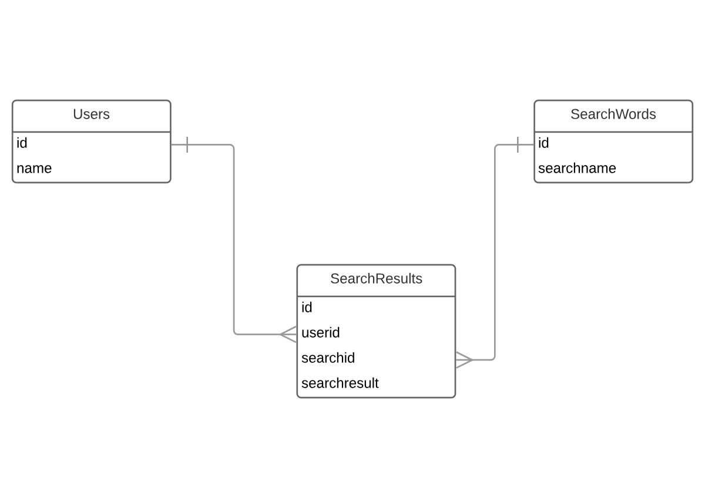

# Sens.ai - Brand Analysis Platform

## Presenting a flip side of the social media web platforms

- Facebook
- Twitter
- Reddit

## About Project

This is a final project for the web development bootcamp at Lighthouse Labs, Toronto to showcase the skills learned.

### Project Description

Sens.ai is a single page web app (SPA) that performs the intent analysis and sentiment analysis for the keyword string entered by the user. Internally it fetches user reviews and comments relevant to the keyword from the back of the social media sites. The intent analyzer identifies whether the review/comment is a complaint, a suggestion or a query. The Sentiment analyzer identifies the tone of the review/comment whether it is positive, negative, or neutral. The final outcome is the analysis report generated with detailed charts describing overall feedback for the collection of posts fetched from social media sites. These results are persisted in the database for future comparision.

### Target auidence

The reviews for the product or service expressed by customers with this app helps determine whether to buy, quit, sell, or recommend your product. This app is developed targeting all business entities. Few examples here...

Traders, Manufacturers, Customers, Service Industry, Individuals

### Team Members

- Sebastian Valiente (https://github.com/sebastianvaliente)
- Mikaal Naik (https://github.com/mikaalnaik)
- Cem Hekimoglu (https://github.com/cemhekimoglu)
- Hemantkumar Panchal (https://github.com/panchalhemant2001)

## Project Planning

### User Stories

- when
- when
- When


### Wireframes


## Stack Choices

### Front End (react and react-dom)

React makes it painless to create interactive UIs. Design simple views for each state in your application, and React will efficiently update and render just the right components when your data changes.

Declarative views make your code more predictable and easier to debug.

Build encapsulated components that manage their own state, then compose them to make complex UIs.

Since component logic is written in JavaScript instead of templates, you can easily pass rich data through your app and keep state out of the DOM.

Reference: https://reactjs.org/

### Back End (node.js)

Node.js is an open-source, cross-platform JavaScript run-time environment that executes JavaScript code server-side.

Reference: https://en.wikipedia.org/wiki/Node.js

### Database (PostgreSQL)

PostgreSQL, often simply Postgres, is an object-relational database management system (ORDBMS) with an emphasis on extensibility and standards compliance. As a database server, its primary functions are to store data securely and return that data in response to requests from other software applications. It can handle workloads ranging from small single-machine applications to large Internet-facing applications (or for data warehousing) with many concurrent users; on macOS Server, PostgreSQL is the default database;[11][12][13] and it is also available for Microsoft Windows and Linux (supplied in most distributions).


Reference: https://en.wikipedia.org/wiki/PostgreSQL

## Project Setup

- Clone this project from git Repo (Write following commands on vagrant)

```
git clone <git repo uri for this project> Sens.ai
```

### dependencies

- "bluebird": "^3.5.1",
- "body-parser": "^1.18.3",
- "change-case": "^3.0.2",
- "chart.js": "^2.7.2",
- "dom-scroll-into-view": "^1.2.1",
- "dotenv": "^6.0.0",
- "express": "^4.16.3",
- "knex": "^0.14.6",
- "moment": "^2.22.2",
- "node-fetch": "^2.1.2",
- "paralleldots": "^3.1.1",
- "pg": "^7.4.3",
- "react": "^16.4.0",
- "react-addons-transition-group": "^15.6.2",
- "react-anchor-link-smooth-scroll": "^1.0.10",
- "react-burger-menu": "^2.5.0",
- "react-chartjs-2": "^2.7.2",
- "react-dom": "^16.4.0",
- "react-fade": "^1.1.1",
- "react-fade-in": "^0.1.6",
- "react-flexbox-grid": "^2.1.2",
- "react-scripts": "1.1.4",
- "react-scroll-into-view": "^1.2.0",
- "react-scroll-to-component": "^1.0.2",
- "react-scrollable-anchor": "^0.6.1",
- "react-spinners": "^0.3.2",
- "twit": "^2.2.10",
- "watson-developer-cloud": "^3.4.5"


### Install dependencies

- Write following commands on vagrant prompt

```
cd Sens.ai
npm install --save
```


## Database Setup

### CREATING NEW DATABASE

- Install Postgress SQL driver and Knex migration tool (on vagrant prompt).

````````
npm install pg --save
npm install knex --save
````````

- Write a following command to create database (on vagrant prompt).
```
psql -U vagrant -d template1

CREATE ROLE sensai WITH LOGIN PASSWORD 'sensai';
CREATE DATABASE sensai OWNER sensai;
```
- To login to Postgress database with user sensai

```
psql -U sensai
```

- To quit and logout Postgress database

```
\q
```

### Database Migration

- Run following KNEX commands to run database migrations.

```
CREATE TABLES: Write following command on vagrant prompt

knex migrate:latest;
```

```
DROP ALL TABLES: Write following command on vagrant prompt

knex migrate:rollback;
```

- Files taking part in database migration using Knex

```
Path: Sens.ai/server/db/migrations

Knex Migration Files:

20180604202202_create_user_table.js
20180604202704_create_search_table.js
20180604203059_create_table_searchresults.js
```

### Database Seeding

- Run following KNEX command to seed the sensai database

```
knex seed:run
```

- Files taking part in database seeding using Knex

```
Path: Sens.ai/server/db/migrations

Knex Seed Files:

1_seed_users.js
2_seed_search_words.js
3_seed_search_results.js
```

### Entity Relationship Diagram (ERD)




## Run application

Open two terminal windows with vagrant promps. One for Server App (Node JS) and other for client app (REACT).

### Start Server Application (Node JS)

```
cd Sens.ai/server

node server.js
```


### Start Client Application (REACT)

```
cd Sens.ai

npm start
```


# Final Product Screenshots


## Project Workflow

## Project Communication

- What has been accomplished
- What will you be working on
- What hardles are you facing

## Project Workflow

1. What are the project milestones: you need to create a list of the project milestones and specify what are the deadlines.

2. Git workflow: establish rules about how you’re going to manage your Git workflow. You can discuss it with a mentor if needed.

3. How to distribute teamwork: before distributing work, you might want to consider working together until you build the core of your app. Afterward, you need to think about how you will distribute the work among your team members.

4. Coding styles: consider establishing some coding guidelines to ensure consistency between team members.


### Project Development

- Deadline: Week 9, Day 5

### Project Deployment

## Testing, bug fixing

# Deadline: Demo day minus 2

- Testing, testing, testing
- Fixing bugs
- Refactoring your code
- Cleaning up your code

### Project Presentation

# Deadline: Demoday minus 1
